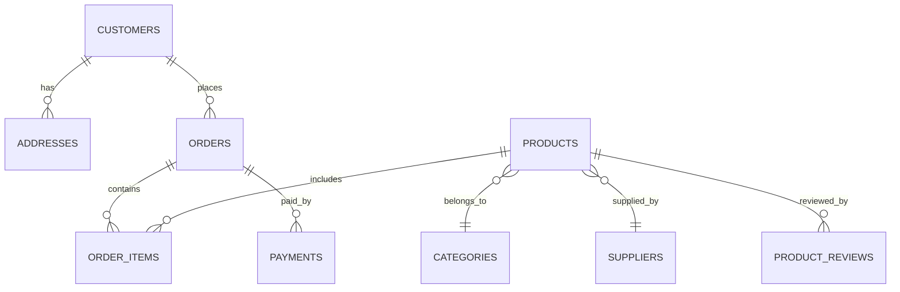

# 🌐 SQL Developer Internship – Task 1

### 🧾 *E-Commerce Database Schema using PostgreSQL & pgAdmin*

---

## 🧩 Project Overview

This project demonstrates the **design and implementation of a relational database schema** for an **E-Commerce Management System**.
It was created as part of *Task 1* for the SQL Developer Internship.

The database captures entities such as **Customers, Products, Orders, Payments, and Suppliers**, designed using **PostgreSQL** and managed through **pgAdmin 4**.
The schema ensures **data normalization (up to 3NF)**, **referential integrity**, and **optimized relationships** between entities.

---

## 📁 Repository Contents

| File              | Description                                                                          |
| ----------------- | ------------------------------------------------------------------------------------ |
| `schema.sql`      | Contains SQL commands to create the database tables, constraints, and relationships. |
| `ER_diagram.png`  | Visual representation of the database schema exported from pgAdmin.                  |
| `README.md`       | Documentation and setup guide for this project.                                      |

---

## 🧱 Database Highlights

✅ **Normalization:** Data structured up to Third Normal Form (3NF).
✅ **Integrity:** All relationships enforced with foreign key constraints.
✅ **Constraints:**

* `CHECK` constraints on prices, quantities, and ratings.
* `UNIQUE` and `NOT NULL` used for key columns.
  ✅ **Auto-increment Keys:** Implemented via `SERIAL` data type.
  ✅ **View:** `order_summary` view computes order totals dynamically.

---

## ⚙️ Tools & Technologies

| Tool           | Purpose                            |
| -------------- | ---------------------------------- |
| **PostgreSQL** | Database engine                    |
| **pgAdmin 4**  | SQL editor & ER diagram generation |
| **GitHub**     | Version control & project hosting  |
| **Markdown**   | Documentation formatting           |

---

## 🪜 Step-by-Step Setup Guide

### 1️⃣ Create Database

1. Open **pgAdmin 4** and connect to your PostgreSQL server.
2. Right-click **Databases → Create → Database...**
3. Enter name: `ecommerce_db` → click **Save**.

### 2️⃣ Execute Schema

1. Open **Query Tool** inside `ecommerce_db`.
2. Paste contents of `schema.sql`.
3. Click **Execute (F5)** → Check “Query returned successfully” message.

### 3️⃣ Verify Tables

Expand:

```
Databases → ecommerce_db → Schemas → public → Tables
```

You should see:
`categories`, `products`, `customers`, `orders`, `order_items`, etc.

### 4️⃣ (Optional) Insert Sample Data

1. Open `sample_data.sql`.
2. Run it inside the same database.
3. Test using:

   ```sql
   SELECT * FROM products;
   SELECT * FROM orders;
   ```

### 5️⃣ Generate ER Diagram

1. In pgAdmin, go to **Tools → ERD Tool**.
2. Choose your `ecommerce_db`.
3. Arrange entities → **Export as Image** → Save as `ER_diagram.png`.

---

## 🧭 ER Diagram (Mermaid View)



---

## 💾 Example SQL Queries

```sql
-- View all customers
SELECT * FROM customers;

-- Find total orders per customer
SELECT customer_id, COUNT(order_id) AS total_orders
FROM orders
GROUP BY customer_id;

-- Check product availability
SELECT name, stock_quantity FROM products WHERE stock_quantity > 0;
```

---

## 📊 Schema Summary

**Key Entities:**

* `customers`, `addresses`, `orders`, `order_items`, `products`, `suppliers`, `payments`, `product_reviews`, `product_images`.

**Relationships:**

* One-to-many between customers and orders.
* Many-to-many between products and orders (via order_items).
* One-to-many between categories and products.

---

## 🧠 Learning Outcomes

By completing this task, the following skills were demonstrated:

* Database schema design and normalization.
* Understanding of relationships and constraints.
* Use of pgAdmin for executing and visualizing SQL scripts.
* Writing clean, maintainable SQL code.

---

## 👩‍💻 Author Information

**Name:** Deekshitha K V
**Role:** SQL Developer Intern
**Database:** PostgreSQL (pgAdmin 4)
**Task:** 1 – Database Schema & ER Diagram

---


> *“Data is not just numbers — it’s the story of your system, structured logically.”*
> — *Deekshitha K V*
